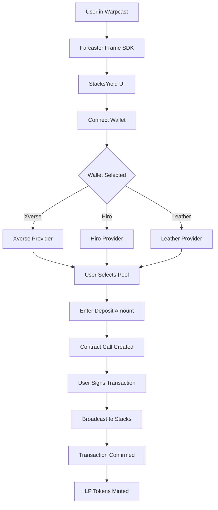

# 🪙 StacksYield

<div align="center">


**A Farcaster Mini-App for earning yield on Stacks blockchain**

*Stake STX tokens in liquidity pools and earn competitive APY through BitFlow-inspired DeFi platform*

[](https://farcaster.xyz)
[](https://stacks.co)
[](https://nextjs.org)
[](https://typescriptlang.org)
[](LICENSE)

[Demo](#-demo) • [Features](#-features) • [Quick Start](#-quick-start) • [Pools](#-liquidity-pools) • [Architecture](#-architecture) • [Contributing](#-contributing)

</div>

---

## 📋 Table of Contents

- [Overview](#-overview)
- [Features](#-features)
- [Demo](#-demo)
- [Tech Stack](#-tech-stack)
- [Quick Start](#-quick-start)
- [Liquidity Pools](#-liquidity-pools)
- [Smart Contract Integration](#-smart-contract-integration)
- [Architecture](#-architecture)
- [Wallet Integration](#-wallet-integration)
- [Farcaster Mini-App](#-farcaster-mini-app)
- [API Reference](#-api-reference)
- [Configuration](#-configuration)
- [Testing](#-testing)
- [Deployment](#-deployment)
- [Security](#-security-considerations)
- [Roadmap](#-roadmap)
- [Contributing](#-contributing)
- [License](#-license)

---

## 🎯 Overview

**StacksYield** is a decentralized Farcaster Mini-App that brings BitFlow-style liquidity pool management to the Stacks ecosystem. Users can deposit STX tokens into various liquidity pools and earn yield without leaving Warpcast or other Farcaster clients.

### The Problem

Traditional DeFi yield platforms require multiple steps:
- Switching between different websites
- Complex wallet connections
- Confusing pool selection
- No mobile-first experience

### The Solution

StacksYield provides:
- 🪙 **One-Click Pool Access** - Deposit STX directly from Farcaster
- 📊 **Real-time APY Tracking** - See live yields across multiple protocols
- 🔄 **Auto-Routing** - Single-sided liquidity with automatic token swaps
- 📱 **Mobile-First** - Optimized for Farcaster's mobile experience

All secured on the Stacks blockchain with native Bitcoin finality.

---

## ✨ Features

<table>
<tr>
<td width="50%">

### 💰 Multi-Protocol Pools
Access liquidity pools from BitFlow, Arkadiko, Velar, and StackingDAO. Compare APYs and TVL across protocols in one interface.

### 📈 Real-Time Data
Pool data refreshes every 30 seconds. Track APY changes, TVL movements, and your positions in real-time.

</td>
<td width="50%">

### 🔐 Multi-Wallet Support
Connect with Xverse, Hiro Wallet, Leather, Asigna, or OKX Wallet. Automatic wallet detection and seamless authentication.

### 🎯 Transaction Routing
Single-sided liquidity deposits with visual route tracking. See exactly how your STX is allocated in the pool.

</td>
</tr>
</table>

### Additional Features

- 🦄 **Farcaster Frame v2** - Native mini-app experience in Warpcast
- 🌐 **Stacks Blockchain** - Bitcoin-secured smart contracts
- 🎨 **Modern UI** - Shadcn UI with Tailwind CSS
- 📱 **Mobile Optimized** - Touch-friendly deposit modals
- ⚡ **Fast Transactions** - Powered by Stacks' microblock streaming
- 🔍 **Transaction Explorer** - Direct links to Hiro Explorer

---

## 🎬 Demo

### Live App
- **Web Preview**: (https://empty-seed-445.app.ohara.ai]

### Screenshots

| Pool Dashboard | Deposit Modal | Transaction Route |
|:-------------:|:-------------:|:-----------------:|
|  |  |  |

---

## 🛠️ Tech Stack

### Frontend
- **Framework**: [Next.js 15.3.8](https://nextjs.org) with App Router
- **Language**: [TypeScript 5.8](https://typescriptlang.org)
- **Styling**: [Tailwind CSS v4](https://tailwindcss.com)
- **UI Components**: [Shadcn UI](https://ui.shadcn.com)
- **Icons**: [Lucide React](https://lucide.dev)
- **Animations**: [Framer Motion](https://framer.com/motion)

### Blockchain
- **Network**: [Stacks Blockchain](https://stacks.co)
- **Wallet SDK**: [@stacks/connect v8.2.4](https://github.com/hirosystems/stacks.js)
- **Transactions**: [@stacks/transactions v7.3.1](https://github.com/hirosystems/stacks.js)
- **Network API**: [@stacks/network v7.3.1](https://github.com/hirosystems/stacks.js)
- **Blockchain API**: [@stacks/blockchain-api-client v8.13.6](https://github.com/hirosystems/stacks.js)

### Farcaster Integration
- **Frame SDK**: [@farcaster/frame-sdk v0.1.12](https://github.com/farcasterxyz/frames)
- **Mini-App SDK**: [@farcaster/miniapp-sdk v0.2.1](https://docs.farcaster.xyz/developers/frames/v2/spec)
- **Quick Auth**: [@farcaster/quick-auth v0.0.8](https://docs.farcaster.xyz/auth-kit/introduction)

### Development
- **Package Manager**: pnpm
- **Linting**: ESLint
- **Type Checking**: TypeScript strict mode
- **Deployment**: Vercel

---

## 🚀 Quick Start

### Prerequisites

Before you begin, ensure you have:
- **Node.js 20+** installed ([Download](https://nodejs.org))
- **pnpm** package manager ([Install](https://pnpm.io))
- **Stacks Wallet** (Xverse, Hiro, or Leather)
- **Test STX** from [Stacks Testnet Faucet](https://explorer.hiro.so/sandbox/faucet?chain=testnet)

### Installation

1. **Clone the repository**
```bash
git clone https://github.com/yourusername/stacksyield.git
cd stacksyield
```

2. **Install dependencies**
```bash
pnpm install
```

3. **Set up environment variables**
```bash
cp .env.example .env.local
```

Edit `.env.local`:
```env
# Network Configuration
NEXT_PUBLIC_STACKS_NETWORK=testnet  # or 'mainnet'

# Farcaster Configuration
NEXT_PUBLIC_FARCASTER_APP_NAME=StacksYield
NEXT_PUBLIC_FARCASTER_ICON_URL=https://stacksyield.app/icon.png

# Optional: Analytics
NEXT_PUBLIC_POSTHOG_KEY=your_posthog_key_here
```

4. **Run development server**
```bash
pnpm dev
```

5. **Open your browser**
```
http://localhost:3000
```

### First-Time Setup

1. **Connect your wallet** - Click "Connect Wallet" and select your Stacks wallet
2. **Get test STX** - Visit the [testnet faucet](https://explorer.hiro.so/sandbox/faucet?chain=testnet)
3. **Select a pool** - Choose from available liquidity pools
4. **Make a deposit** - Enter amount and confirm transaction

---

## 💧 Liquidity Pools

StacksYield aggregates pools from multiple Stacks DeFi protocols:

### Available Pools (Testnet)

| Pool | Protocol | APY | TVL | Min Deposit | Contract Address |
|------|----------|-----|-----|-------------|------------------|
| **STX-xBTC** | BitFlow | 42.5% | $2.45M | 10 STX | `SP3K8BC0PPEVCV7NZ6QSRWPQ2JE9E5B6N3PA0KBR9.stx-xbtc-pool` |
| **STX-USDA** | Arkadiko | 28.3% | $1.85M | 10 STX | `SP2C2YFP12AJZB4MABJBAJ55XECVS7E4PMMZ89YZR.arkadiko-stx-usda-pool` |
| **STX-WELSH** | Velar | 156.8% | $680K | 5 STX | `SP1Y5YSTAHZ88XYK1VPDH24GY0HPX5J4JECTMY4A1.stx-welsh-pool` |
| **STX-stSTX** | StackingDAO | 18.2% | $3.2M | 20 STX | `SP4SZE494VC2YC5JYG7AYFQ44F5Q4PYV7DVMDPBG.stx-ststx-pool` |
| **STX-ORDI** | BitFlow | 89.4% | $420K | 5 STX | `SP3K8BC0PPEVCV7NZ6QSRWPQ2JE9E5B6N3PA0KBR9.stx-ordi-pool` |

### Pool Selection Criteria

**High APY Pools** (>100%):
- Higher risk/reward
- Newer or less liquid tokens
- Best for risk-tolerant users

**Stable Pools** (<50%):
- Lower risk
- Established tokens (USDA, xBTC)
- Suitable for conservative yield

**Staking Pools** (stSTX):
- Native Stacks staking rewards
- Bitcoin yield through PoX
- Best for long-term holders

---

## 📜 Smart Contract Integration

### Contract Structure

StacksYield interacts with standard liquidity pool contracts on Stacks:

```clarity
;; Example Pool Contract Interface
(define-public (deposit (amount uint) (sender principal))
  ;; Transfers STX from sender
  ;; Mints LP tokens
  ;; Emits deposit event
)

(define-public (withdraw (shares uint) (recipient principal))
  ;; Burns LP tokens
  ;; Returns STX to recipient
  ;; Emits withdrawal event
)

(define-read-only (get-pool-data)
  ;; Returns TVL, reserves, APY
)
```

### Transaction Flow

1. **User Initiates Deposit**
```typescript
// src/lib/stacks/contracts.ts
await depositToPool(
  'SP3K8BC0PPEVCV7NZ6QSRWPQ2JE9E5B6N3PA0KBR9.stx-xbtc-pool',
  100, // 100 STX
  userAddress
)
```

2. **Contract Call Creation**
```typescript
openContractCall({
  network: STACKS_TESTNET,
  contractAddress: 'SP3K8BC0PPEVCV7NZ6QSRWPQ2JE9E5B6N3PA0KBR9',
  contractName: 'stx-xbtc-pool',
  functionName: 'deposit',
  functionArgs: [
    uintCV(100_000_000), // microSTX
    standardPrincipalCV(userAddress)
  ]
})
```

3. **User Signs Transaction** - Wallet popup for approval

4. **Transaction Broadcast** - Submitted to Stacks mempool

5. **Confirmation** - Link to [Hiro Explorer](https://explorer.hiro.so)

### Mainnet Contract Addresses

> ⚠️ **Update these with production contracts before mainnet deployment**

```typescript
// src/lib/stacks/contracts.ts
export const MAINNET_POOLS = {
  'stx-xbtc': 'SP3K8BC0PPEVCV7NZ6QSRWPQ2JE9E5B6N3PA0KBR9.stx-xbtc-pool-v2',
  'stx-usda': 'SP2C2YFP12AJZB4MABJBAJ55XECVS7E4PMMZ89YZR.arkadiko-stx-usda-v3',
  // ... more pools
}
```

---

## 🏗️ Architecture

### Project Structure

```
stacksyield/
├── src/
│   ├── app/                        # Next.js App Router
│   │   ├── api/                    # API Routes
│   │   │   ├── health/             # Health check endpoint
│   │   │   ├── stacks-balance/     # STX balance fetcher
│   │   │   ├── proxy/              # CORS proxy for external APIs
│   │   │   └── me/                 # Farcaster Quick Auth
│   │   ├── layout.tsx              # Root layout + Farcaster metadata
│   │   ├── page.tsx                # Main pool dashboard
│   │   └── globals.css             # Global styles
│   │
│   ├── components/                 # React Components
│   │   ├── ui/                     # Shadcn UI components
│   │   ├── WalletConnect.tsx       # Multi-wallet connection
│   │   ├── PoolTable.tsx           # Liquidity pool list
│   │   ├── DepositModal.tsx        # Deposit interface
│   │   ├── RouteVisualizer.tsx     # Transaction route display
│   │   ├── FarcasterWrapper.tsx    # Farcaster context provider
│   │   └── ...
│   │
│   ├── hooks/                      # Custom React Hooks
│   │   ├── useFarcaster.ts         # Farcaster SDK context
│   │   ├── useStacks.ts            # Stacks wallet connection
│   │   ├── usePools.ts             # Pool data fetching
│   │   ├── useDeposit.ts           # Deposit transaction logic
│   │   ├── useQuickAuth.tsx        # Farcaster authentication
│   │   └── ...
│   │
│   ├── lib/                        # Core Libraries
│   │   ├── stacks/
│   │   │   ├── network.ts          # Network configuration
│   │   │   ├── wallet.ts           # Wallet connection logic
│   │   │   └── contracts.ts        # Smart contract interactions
│   │   ├── utils.ts                # Utility functions
│   │   └── logger.ts               # Winston logger
│   │
│   └── types/                      # TypeScript Type Definitions
│       ├── pool.ts                 # Pool interfaces
│       └── stacks.ts               # Stacks transaction types
│
├── public/
│   └── .well-known/
│       └── farcaster.json          # Farcaster Frame manifest
│
├── package.json                    # Dependencies
├── tsconfig.json                   # TypeScript config
├── tailwind.config.ts              # Tailwind configuration
└── next.config.js                  # Next.js configuration
```

### Data Flow



### Component Hierarchy

```
HomePage
├── WalletConnect
│   ├── Button (Connect/Disconnect)
│   └── Badge (Wallet info)
├── PoolTable
│   ├── Table (Pool list)
│   └── DepositModal
│       ├── Input (Amount)
│       ├── RouteVisualizer
│       └── Button (Confirm)
└── StatsCards
    ├── Card (Total TVL)
    ├── Card (Highest APY)
    └── Card (Active Pools)
```

---

## 🔐 Wallet Integration

### Supported Wallets

StacksYield uses `@stacks/connect` v8 for multi-wallet support:

| Wallet | Type | Mobile | Desktop | Status |
|--------|------|--------|---------|--------|
| **Xverse** | Browser Extension + Mobile | ✅ | ✅ | Fully Supported |
| **Hiro Wallet** | Browser Extension | ❌ | ✅ | Fully Supported |
| **Leather** | Browser Extension | ❌ | ✅ | Fully Supported |
| **Asigna** | Multi-sig | ✅ | ✅ | Fully Supported |
| **OKX Wallet** | Multi-chain | ✅ | ✅ | Fully Supported |

### Connection Flow

```typescript
// src/lib/stacks/wallet.ts
import { connect } from '@stacks/connect';

export async function connectWallet() {
  const response = await connect({
    onFinish: (payload) => {
      const address = payload.addresses.stx[0].address;
      // Store wallet info
    },
    onCancel: () => {
      // Handle cancellation
    }
  });
}
```

### Wallet Detection

The app automatically detects installed wallets:

```typescript
// Browser provider detection
const hasXverse = !!window.XverseProviders;
const hasHiro = !!window.HiroWalletProvider;
const hasLeather = !!window.LeatherProvider;
```

### Transaction Signing

All transactions use Stacks' standardized signing flow:

1. User initiates action (deposit/withdraw)
2. Transaction parameters prepared
3. Wallet popup opened
4. User reviews and signs
5. Transaction broadcast
6. Confirmation modal with Explorer link

---

## 🦄 Farcaster Mini-App

### Frame v2 Configuration

StacksYield is a native Farcaster Frame v2 application:

```json
// public/.well-known/farcaster.json
{
  "accountAssociation": {
    "header": "...",
    "payload": "...",
    "signature": "..."
  },
  "frame": {
    "version": "next",
    "name": "StacksYield",
    "description": "Earn yield on your Stacks tokens",
    "iconUrl": "https://stacksyield.app/icon.png",
    "homeUrl": "https://stacksyield.app",
    "buttonTitle": "Launch StacksYield"
  }
}
```

### SDK Integration

```typescript
// src/hooks/useFarcaster.ts
import { sdk } from '@farcaster/miniapp-sdk';

export function useFarcaster() {
  const [user, setUser] = useState(null);
  
  useEffect(() => {
    sdk.actions.ready(); // Signal app is ready
    const context = sdk.context;
    setUser(context.user);
  }, []);
  
  return { user, isReady: !!user };
}
```

### Quick Auth

Farcaster Quick Auth allows users to authenticate without wallet connection:

```typescript
// src/hooks/useQuickAuth.tsx
import { useQuickAuth } from '@farcaster/quick-auth';

const { data, signIn } = useQuickAuth({
  onSuccess: (user) => {
    // User authenticated
  }
});
```

---

## 🔌 API Reference

### Internal APIs

#### `GET /api/health`
Health check endpoint

**Response:**
```json
{
  "status": "ok",
  "timestamp": "2024-01-20T10:30:00Z"
}
```

#### `GET /api/stacks-balance?address={address}`
Fetch STX balance for an address

**Parameters:**
- `address` (string): Stacks address

**Response:**
```json
{
  "balance": 1000000000,
  "locked": 0,
  "address": "SP2..."
}
```

#### `POST /api/proxy`
CORS proxy for external API calls

**Body:**
```json
{
  "protocol": "https",
  "origin": "api.hiro.so",
  "path": "/extended/v1/address/{address}/balances",
  "method": "GET",
  "headers": {}
}
```

### External APIs

#### Hiro Stacks API

**Base URL:** `https://api.testnet.hiro.so` (testnet)

```bash
# Get account balance
curl https://api.testnet.hiro.so/extended/v1/address/SP2.../balances

# Get transaction status
curl https://api.testnet.hiro.so/extended/v1/tx/0x...
```

**Documentation:** https://docs.hiro.so/api

---

## ⚙️ Configuration

### Network Configuration

```typescript
// src/lib/stacks/network.ts
export const NETWORK_MODE: 'testnet' | 'mainnet' = 'testnet';

export const STACKS_API_URL = 
  NETWORK_MODE === 'mainnet' 
    ? 'https://api.hiro.so' 
    : 'https://api.testnet.hiro.so';
```

**To switch to mainnet:**
1. Change `NETWORK_MODE` to `'mainnet'`
2. Update contract addresses in `usePools.ts`
3. Update Farcaster manifest URLs
4. Deploy to production domain

### Pool Configuration

Add/modify pools in `src/hooks/usePools.ts`:

```typescript
const MOCK_POOLS: Pool[] = [
  {
    id: 'stx-new-token',
    name: 'STX-NEW',
    asset: 'STX',
    pairedAsset: 'NEW',
    apy: 50.0,
    tvl: 1_000_000,
    protocol: 'YourProtocol',
    contractAddress: 'SP....your-contract',
    minDeposit: 10,
  },
  // ...
];
```

### Environment Variables

Create `.env.local`:

```env
# Required
NEXT_PUBLIC_STACKS_NETWORK=testnet

# Optional
NEXT_PUBLIC_POSTHOG_KEY=phc_xxx
NEXT_PUBLIC_SENTRY_DSN=https://xxx@sentry.io/xxx
```

---

## 🧪 Testing

### Manual Testing Checklist

- [ ] Wallet connection (Xverse, Hiro, Leather)
- [ ] Pool data loads correctly
- [ ] Deposit modal opens
- [ ] Amount validation works
- [ ] Transaction signing succeeds
- [ ] Explorer link redirects correctly
- [ ] Mobile responsiveness
- [ ] Farcaster Frame loads in Warpcast

### Testing with Testnet

1. **Get Test STX**
```
Visit: https://explorer.hiro.so/sandbox/faucet?chain=testnet
Enter your address
Receive ~500 test STX
```

2. **Test Deposit**
```
1. Connect wallet
2. Select STX-xBTC pool
3. Enter 10 STX
4. Confirm transaction
5. Verify in Explorer
```

3. **Check Transaction**
```
https://explorer.hiro.so/txid/0xYOUR_TX_ID?chain=testnet
```

### Unit Testing (Future)

```bash
# Install testing dependencies
pnpm add -D vitest @testing-library/react

# Run tests
pnpm test
```

---

## 🚀 Deployment

### Vercel Deployment (Recommended)

1. **Install Vercel CLI**
```bash
npm i -g vercel
```

2. **Deploy**
```bash
vercel
```

3. **Set Environment Variables**
```bash
vercel env add NEXT_PUBLIC_STACKS_NETWORK
# Enter 'mainnet' for production
```

4. **Deploy to Production**
```bash
vercel --prod
```

### Manual Deployment

```bash
# Build the app
pnpm build

# Start production server
pnpm start
```

### Docker Deployment

```dockerfile
FROM node:20-alpine
WORKDIR /app
COPY package*.json ./
RUN pnpm install --frozen-lockfile
COPY . .
RUN pnpm build
EXPOSE 3000
CMD ["pnpm", "start"]
```

```bash
docker build -t stacksyield .
docker run -p 3000:3000 stacksyield
```

### Farcaster Frame Registration

1. Deploy to production domain
2. Update `public/.well-known/farcaster.json` with production URLs
3. Submit frame to Farcaster: https://warpcast.com/~/developers/frames

---

## 🔒 Security Considerations

### Smart Contract Risks

- ⚠️ **Audit Status**: Contracts are NOT audited. Use at your own risk.
- ⚠️ **Testnet Only**: Current deployment is testnet. No real funds.
- ⚠️ **Impermanent Loss**: Liquidity pools carry IL risk.

### Best Practices

1. **Always verify contract addresses** before depositing
2. **Start with small amounts** on testnet
3. **Use hardware wallets** for mainnet (Ledger support in Xverse/Hiro)
4. **Check transaction details** before signing
5. **Understand pool risks** (APY can change, IL exists)

### Wallet Security

- Never share seed phrases
- Use strong passwords
- Enable 2FA where available
- Verify URLs (phishing protection)

### Code Security

- TypeScript strict mode enabled
- Input validation on all forms
- No private keys stored
- Client-side wallet signing only

---

## 🗺️ Roadmap

### Phase 1: MVP (Current)
- ✅ Multi-wallet connection
- ✅ Pool dashboard
- ✅ Deposit functionality
- ✅ Farcaster Frame v2 integration
- ✅ Testnet deployment

### Phase 2: Enhanced Features (Q2 2024)
- [ ] Withdraw functionality
- [ ] User position tracking
- [ ] Historical APY charts
- [ ] Portfolio analytics
- [ ] Transaction history

### Phase 3: Advanced DeFi (Q3 2024)
- [ ] Auto-compounding vaults
- [ ] Yield aggregation
- [ ] Zapping (multi-token deposits)
- [ ] Limit orders
- [ ] Stop-loss automation

### Phase 4: Mainnet Launch (Q4 2024)
- [ ] Security audit
- [ ] Mainnet deployment
- [ ] Real protocol integrations
- [ ] Marketing campaign
- [ ] Community governance

### Future Considerations
- Multi-chain support (Base, Ethereum L2s via Bitcoin bridges)
- NFT reward system
- Referral program
- Mobile native app
- Advanced trading features

---

## 🤝 Contributing

We welcome contributions! Here's how you can help:

### Getting Started

1. **Fork the repository**
2. **Create a feature branch**
```bash
git checkout -b feature/amazing-feature
```
3. **Make your changes**
4. **Commit with conventional commits**
```bash
git commit -m "feat: add amazing feature"
```
5. **Push to your fork**
```bash
git push origin feature/amazing-feature
```
6. **Open a Pull Request**

### Contribution Guidelines

- Follow TypeScript best practices
- Add types for all functions
- Use Tailwind for styling (no custom CSS)
- Test on mobile viewports
- Update documentation
- Add comments for complex logic

### Code Style

```typescript
// ✅ Good
export async function depositToPool(
  poolAddress: string,
  amount: number,
  userAddress: string
): Promise<TransactionResult> {
  // Implementation
}

// ❌ Bad
export async function deposit(addr, amt, user) {
  // Implementation
}
```

### Areas Needing Help

- [ ] Mainnet contract integration
- [ ] Unit/integration tests
- [ ] APY calculation algorithms
- [ ] Mobile UX improvements
- [ ] Documentation translations

---

## 📄 License

This project is licensed under the **MIT License** - see the [LICENSE](LICENSE) file for details.

```
MIT License

Copyright (c) 2024 StacksYield

Permission is hereby granted, free of charge, to any person obtaining a copy
of this software and associated documentation files (the "Software"), to deal
in the Software without restriction, including without limitation the rights
to use, copy, modify, merge, publish, distribute, sublicense, and/or sell
copies of the Software, and to permit persons to whom the Software is
furnished to do so, subject to the following conditions:

The above copyright notice and this permission notice shall be included in all
copies or substantial portions of the Software.

THE SOFTWARE IS PROVIDED "AS IS", WITHOUT WARRANTY OF ANY KIND, EXPRESS OR
IMPLIED, INCLUDING BUT NOT LIMITED TO THE WARRANTIES OF MERCHANTABILITY,
FITNESS FOR A PARTICULAR PURPOSE AND NONINFRINGEMENT. IN NO EVENT SHALL THE
AUTHORS OR COPYRIGHT HOLDERS BE LIABLE FOR ANY CLAIM, DAMAGES OR OTHER
LIABILITY, WHETHER IN AN ACTION OF CONTRACT, TORT OR OTHERWISE, ARISING FROM,
OUT OF OR IN CONNECTION WITH THE SOFTWARE OR THE USE OR OTHER DEALINGS IN THE
SOFTWARE.
```

---

## 🙏 Acknowledgments

- **Stacks Foundation** - For the amazing Bitcoin L2
- **BitFlow Team** - Design inspiration
- **Farcaster** - Frame v2 protocol
- **Hiro** - Stacks developer tools
- **Shadcn** - Beautiful UI components
- **Vercel** - Deployment platform

---

## 📞 Contact & Support

- **GitHub Issues**: [Report bugs]([https://github.com/sinirlibiber/xSTX-StacksYield/)
- **Twitter**: [@angrypepp3r](https://twitter.com/angrypepp3r)
- **Farcaster**: [@gumusbey](https://warpcast.com/gumusbey)

---

<div align="center">

**Built with ❤️ on Stacks**

[⬆ Back to Top](#-stacksyield)

</div>
